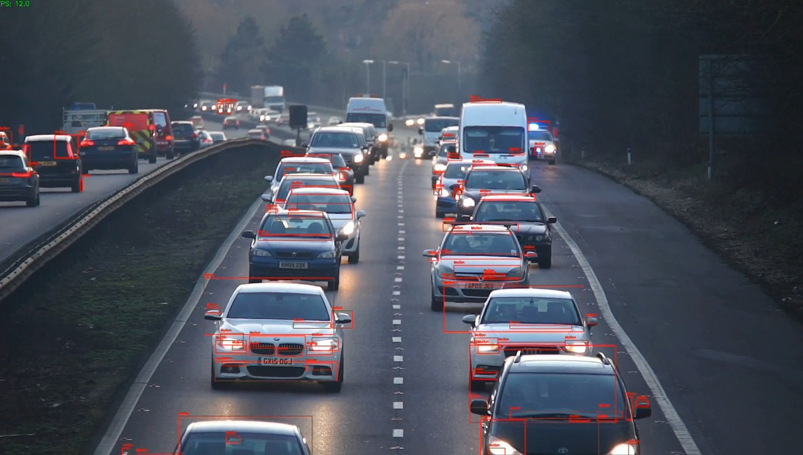

<div align="center">
  
</div>

# 실시간 움직임 감지 및 녹화 도구

이 도구는 비디오나 웹캠에서 실시간으로 움직임을 감지하고, 감지된 움직임 주변에 박스를 표시한 비디오를 생성하는 파이썬 스크립트입니다. OpenCV를 사용하여 구현되었습니다.

## ✨ 주요 기능

- 실시간 움직임 감지 및 박스 표시
- 웹캠 또는 비디오 파일 입력 지원
- FPS 실시간 표시
- 움직임이 감지된 영역에 빨간색 박스와 레이블 표시
- 모든 프레임을 하나의 출력 비디오로 저장
- 감도 조절 가능 (임계값, 최소 컨투어 면적)

## 🛠 설치 방법

1. 필요한 패키지 설치:
```bash
pip install -r requirements.txt
```

## 🚀 사용 방법

### 기본 사용법 (웹캠):
```bash
python motion_detector.py 0
```

### 비디오 파일 사용:
```bash
python motion_detector.py input_video.mp4
```

### 옵션:
```
--output, -o      출력 디렉토리 (기본값: output/)
--threshold, -t   움직임 감지 임계값 (기본값: 500, 낮을수록 민감)
--min-area        움직임으로 인식할 최소 컨투어 면적 (기본값: 500)
--min-duration    움직임으로 인식할 최소 지속 시간(초) (기본값: 1.0)
```

### 사용 예시:
```bash
# 웹캠으로 실행 (기본 설정)
python motion_detector.py 0

# 비디오 파일로 실행 (사용자 정의 설정)
python motion_detector.py input.mp4 --output my_output --threshold 300 --min-area 300
```

## 📁 출력

- 처리된 비디오는 `output` 디렉토리(또는 지정한 디렉토리)에 저장됩니다.
- 출력 파일명 형식: `motion_detected_YYYYMMDD_HHMMSS.mp4`
- 콘솔에 움직임 감지 시작/종료 시간이 표시됩니다.

## ⚙️ 조정 가이드

- **민감도 조절**
  - `--threshold` 값을 낮추면 더 민감해집니다 (기본값: 500)
  - `--min-area` 값을 낮추면 더 작은 움직임도 감지합니다 (기본값: 500)

- **성능 최적화**
  - 고해상도 비디오의 경우 `--min-area` 값을 높이면 성능이 향상됩니다.
  - 실시간 처리가 느리다면 해상도를 낮추거나 `--min-area` 값을 높여보세요.

## 🛑 주의 사항

- 'q' 키를 누르면 프로그램이 종료됩니다.
- 웹캠을 사용할 때는 카메라 번호(일반적으로 0 또는 1)를 입력하세요.
- 출력 비디오는 MP4 형식으로 저장됩니다.

## 📜 라이선스

이 프로젝트는 MIT 라이선스 하에 배포됩니다.
